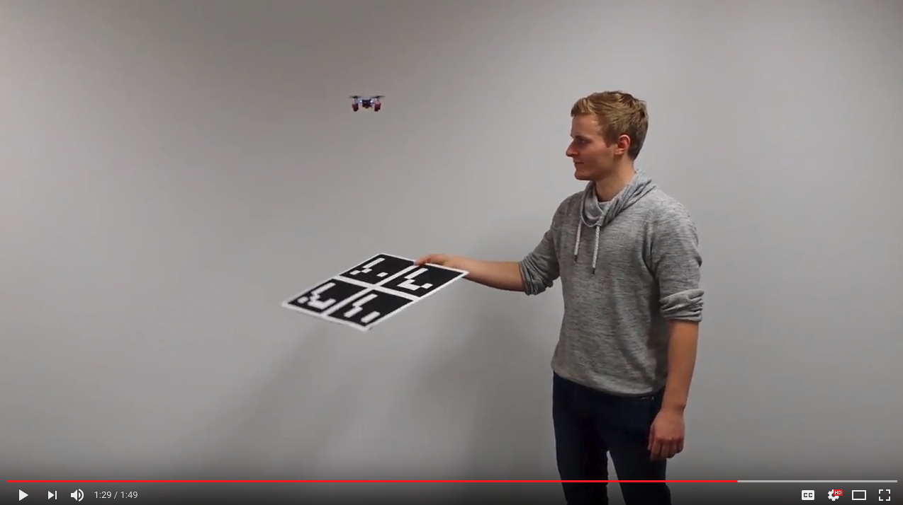
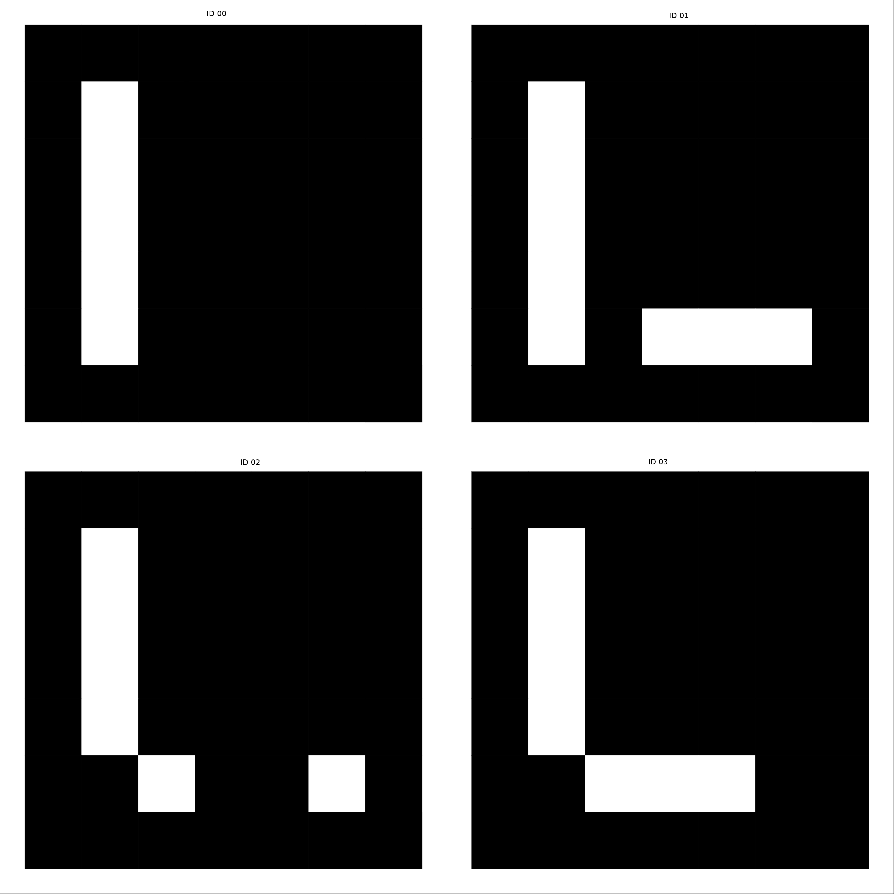
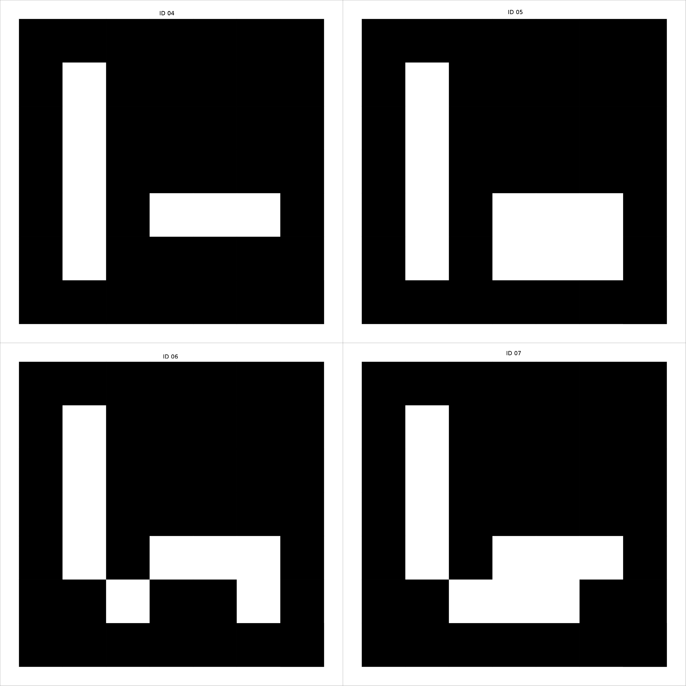

# ar_nav
A ROS package offering an autonomous flight including waypoint navigation with a Crazyflie 2.0 quadcopter using ArUco markers

The system obtains an image from a wireless camera attached to the Crazyflie 2.0, the image is deinterlaced and processed to improve its quality and the distortion is removed. Once the image is ready, the ar_sys package is used for Aruco marker detection and the relative 3D pose of the Crazyflie to the marker is estimated and published.

The target and current pose are then sent to the crazyflie_ros package were the PID control of the quadcopter is implemented and the control signals are sent to the hardware platform.

By default the target pose is above the center of the defined Aruco marker with a height that can be configured and modified on runtime.

[](https://youtu.be/OU_q05TPRPM "ar_nav Youtube Video demonstration")


# Required harware
- Crazyflie 2.0 with a wireless camera attached to the bottom. For details see the following documents: (Link to the projekt seminar and the bachelor thesis of Guillem)
- Printed marker boards glued to a hard surface (e.g cardboard)
- A gamepad, currently the joy ros node is configured to work with the configuration of a Logitech Wireless Gamepad F710. But it can be adapated to any gamepad.


Make sure that the Crazyflie ROS package works perfectly with the instructions provided by the package.


## Dependencies (non-native)

This package relies on several ROS packages:
- [usb_cam](http://wiki.ros.org/usb_cam): The usb_cam package interfaces with standard USB cameras and publish the images as a sensor_msgs.
- [tud_img_prep](https://github.com/raultron/tud_img_prep): The tud_image_prep package is a set of tools for processing camera images with techniques that include deinterlace of analog images and filtering.
- [image_proc](http://wiki.ros.org/image_proc): Image rectification, this package contains the image_proc node that removes camera distortion from the raw image stream, and if necessary will convert Bayer or YUV422 format image data to color. (it is assumed a proper camera calibration using ROS [camera_calibration](http://wiki.ros.org/camera_calibration) package or any other external tool)
- [ar_sys](https://github.com/raultron/ar_sys): For Aruco marker 3D pose estimation. In essence this can be replaced by any other marker.
- [crazyflie_ros](https://github.com/whoenig/crazyflie_ros): Official package for sending commands and receiving sensor information from the Crazyflie 2.0.  The package
contains core drivers to use the Crazyflie with ROS, a URDF model of the quadrotor, a simple navigation to goal if it is known
the external position and different demos ready to run for Crazyflie.

In the src directory of your ROS catking workspace:
```
cd ~\catkin_ws\src
```
Clone all the necessary packages:
```
git clone https://github.com/raultron/tud_img_prep.git

git clone https://github.com/raultron/ar_sys.git

git clone https://github.com/whoenig/crazyflie_ros.git
```
The other packages should be in your ROS distribution.

## Installation
Clone the ar_nav repository and compile:
```
git clone https://github.com/denkrau/ar_nav.git
```

Build all the packages using catkin tools:

```
catkin build ar_nav ar_sys tud_img_prep crazyflie
```


This builds two nodes. The correct node for hovering is `single` and for waypoint navigation `multi`.


## Usage

Print the marker boards provided in the [data](data) folder. Use a calibrated printer so the markers have the correct measurement.

Our board configurations are named after the robots of our lab (we attach the marker boards on top of them).

### C3PO:



- Top Left corner: ID0
- Top Right corner: ID1
- Bottom Left corner: ID2
- Bottom Right corner: ID3
- Aruco marker Side length = 16 cm
- Separation Between Markers = 2 cm
- Coordinate system = located in the center of the marker. Holding the marker board in your hands and looking straigth to it with ID0 on the top left corner: X axis right, Y axis up and Z axis coming out of the marker plane.
- Yaml file for ar_sys: [board_c3po.yml](data/board_c3po.yml)

### R2D2:



- Top Left corner: ID4
- Top Right corner: ID5
- Bottom Left corner: ID6
- Bottom Right corner: ID7
- Aruco marker Size = 16 cm
- Yaml file for ar_sys: [board_r2d2.yml](data/board_r2d2.yml)


# Run the node
If you want to detect only one board (by default c3po) then use:

```
rosrun ar_nav single [params]
```

If you want to detect any number of boards simultaneously then modify the file [boards.yml](data/boards.yml) accoringly, by default c3po and r2d2, and then run:

```
rosrun ar_nav multi [params]
```

Due to the many parameters, the recommended way is using the launch files with
```
roslaunch ar_nav ar_nav_prep_single.launch
```
or
```
roslaunch ar_nav ar_nav_prep_multi.launch
```

## Interaction
### Subscriber
- marker_pose `<geometry_msgs::TransformStamped>` (in `single` `<geometry_msgs::PoseStamped>`)

### Publisher
- cf_pose `<geometry_msgs::PoseStamped>`
- debug_pose `<geometry_msgs::PoseStamped>`

### Services
- next_waypoint `<std_srvs::Empty::Request&, std_srvs::Empty::Response&>`
- prev_waypoint `<std_srvs::Empty::Request&, std_srvs::Empty::Response&>`

### Parameter
- marker_pose_topic `<std::string>`
- world_frame `<std::string>`
- cf_frame `<std::string>`
- waypoints `<std::string>` (seperated by `|`)
- method `<std::string>` (either `auto` or `manual`)
